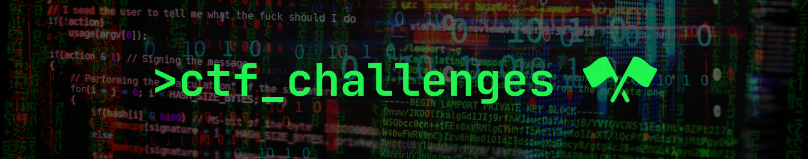

    This repository hosts a collection of CTF challenges I've created. Each challenge is available on a separate branch, with detailed instructions provided in the corresponding README file. Feel free to submit any issues or pull requests if you have any suggestions or improvements. Have fun! 🚀

# 🌀 About

I created this project to learn more about cybersecurity and CTFs. I've had fun solving challenges on other platforms and wanted to try creating my own. Below are some challenges that I've been working and wanted to showcase here.

# 🚩 List of Challenges

  

      <h3>
          🕸️ Web
      </h3>
  

| Challenge                                                           | Difficulty | Language(s)  |
| ------------------------------------------------------------------- | ---------- | ------------ |
| [`web-0x00`](https://github.com/tthn0/CTF-Challenges/tree/web-0x00) | `⭑⭑⭒⭒⭒⭒`   | `JavaScript` |
| [`web-0x01`](https://github.com/tthn0/CTF-Challenges/tree/web-0x01) | `⭑⭑⭑⭒⭒⭒`   | `Python`     |
| [`web-0x02`](#)                                                     | `TBD`      | `TBD`        |

  

      <h3>
          🔐 Crypto
      </h3>
  

| Challenge          | Difficulty | Language(s) |
| ------------------ | ---------- | ----------- |
| [`crypto-0x00`](#) | `TBD`      | `TBD`       |

# 📓 Notes

- All flags will have the following format: `FLAG{...}`.
- No port scanning is required; all challenges will run on their specified port.
- The challenges are independent of each other. Completing one doesn't lead to solving another.

# 📋 Todo

- [ ] Create write-ups for each challenge.
- [ ] Create a web interface for the website's default landing page.
- [ ] Create a flag submission page along with a scoreboard.
